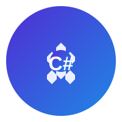

<div align="center">



# .NET Skills Hub

> Discover, browse, and install GitHub Copilot skills for C# .NET development.

[](https://dotnet-skills-hub.github.io)
[](https://github.com/dotnet-skills-hub/dotnet-skills-hub/blob/main/skills/registry.json)
[](https://dotnet.microsoft.com/)

</div>

---

## What is this?

.NET Skills Hub is a curated catalog of GitHub Copilot skills exclusively focused on **C# .NET development**. From ASP.NET Core APIs to Entity Framework migrations, from xUnit testing to NuGet package management — find the right skill for every .NET task.

Unlike general-purpose skill catalogs, every skill here is vetted for .NET relevance and organized into 12 specialized categories covering the entire .NET ecosystem.

## Features

- 🔷 **Browse by Category** — 12 curated categories covering .NET Core, ASP.NET, EF Core, Testing, MSBuild, NuGet, MAUI, AI/ML, Diagnostics, and more
- 🔍 **Search & Filter** — Quickly find skills by name, description, or trigger keywords
- ⚡ **One-Click Install** — Copy installation commands directly from the website
- 🛠️ **CLI Extension** — Install and manage skills via `gh dotnet-skills-hub` command
- 🔒 **Security Scanning** — Two-pass validation (regex + AI) for all skill sources
- 🤖 **AI Enrichment** — Automated metadata generation using GitHub Copilot SDK

## Browse Skills

🌐 **Live Site:** [dotnet-skills-hub.github.io](https://dotnet-skills-hub.github.io)

📋 **Skills Registry:** [`skills/registry.json`](skills/registry.json)

## Categories

| Category | Icon | Skills | Description |
|----------|------|--------|-------------|
| .NET Core & Fundamentals | 🔷 | 3 | C# syntax, LINQ, async/await, dependency injection |
| ASP.NET & Web APIs | 🌐 | 3 | REST APIs, Minimal APIs, Blazor, SignalR |
| Entity Framework & Data | 🗄️ | 3 | EF Core, migrations, LINQ to SQL, Dapper |
| Testing & Quality | 🧪 | 3 | xUnit, NUnit, MSTest, Moq, FluentAssertions |
| MSBuild & Build System | 🔧 | 3 | Project files, build optimization, NuGet packages |
| NuGet & Package Management | 📦 | 3 | NuGet packages, dependency management, versioning |
| Migration & Upgrade | ⬆️ | 3 | Framework migration, .NET 6→8→10, API compat |
| .NET MAUI & Mobile | 📱 | 3 | Cross-platform UI, XAML, mobile development |
| AI & ML with .NET | 🤖 | 3 | ML.NET, Semantic Kernel, LLM integration, MCP |
| Diagnostics & Performance | 🔍 | 3 | Performance investigations, debugging, incident analysis |
| Template Engine & Scaffolding | 🏗️ | 3 | Template discovery, project scaffolding, template authoring |
| Security & Auth | 🔒 | 3 | Identity, OAuth, OWASP, secure coding |

## Install a Skill

GitHub Copilot automatically discovers skills in `.github/skills/` directories. Add skills to your repository to make them available to Copilot.

### Option 1: CLI Extension

Install the GitHub CLI extension:

```bash
gh extension install dotnet-skills-hub/dotnet-skills-hub
```

Then install any skill:

```bash
# List all skills
gh dotnet-skills-hub list

# Search for skills
gh dotnet-skills-hub search async

# Get skill info
gh dotnet-skills-hub info dotnet-dependency-injection

# Install a skill
gh dotnet-skills-hub install dotnet-dependency-injection

# Remove a skill
gh dotnet-skills-hub remove dotnet-dependency-injection
```

### Option 2: Download from Website

1. Browse skills at [dotnet-skills-hub.github.io](https://dotnet-skills-hub.github.io)
2. Click **Install** to copy the command
3. Run the command in your project:
   ```bash
   gh copilot skill add <skill-name>
   ```

## Project Structure

```
dotnet-skills-hub/
├── .github/
│   ├── workflows/
│   │   ├── deploy.yml              # Deploy site to GitHub Pages
│   │   ├── validate-skill.yml      # Validate PR changes
│   │   ├── sync-skills.yml         # Weekly skill sync
│   │   └── enrich-skills.yml       # AI metadata enrichment
│   ├── ISSUE_TEMPLATE/
│   │   ├── new-skill.yml           # New skill submission form
│   │   └── bug-report.yml          # Bug report form
│   └── pull_request_template.md    # PR template
├── scripts/
│   ├── aggregate-skills.js         # Aggregate skills from sources
│   ├── scan-skills.js              # Security scanning (2-pass)
│   └── enrich-skills.js            # AI-powered enrichment
├── skills/
│   ├── registry.json               # Curated skills catalog
│   ├── schema.json                 # JSON Schema definition
│   └── security-rules.yml          # Security scan rules (13)
├── site/                           # Astro static site
│   ├── src/
│   │   ├── layouts/
│   │   │   └── Layout.astro        # Base layout
│   │   ├── components/
│   │   │   ├── SearchBar.astro     # Search component
│   │   │   ├── CategoryCard.astro  # Category display
│   │   │   └── SkillCard.astro     # Skill display
│   │   ├── pages/
│   │   │   ├── index.astro         # Homepage
│   │   │   ├── skills/
│   │   │   │   └── [id].astro      # Skill detail pages
│   │   │   └── categories/
│   │   │       └── [id].astro      # Category pages
│   │   ├── styles/
│   │   │   └── global.css          # Dark theme styles
│   │   └── data/
│   │       ├── .gitkeep
│   │       └── skills.json         # Generated by aggregate
│   ├── public/                     # Static assets
│   ├── astro.config.mjs
│   ├── tsconfig.json
│   └── package.json
├── sources/                        # Git submodules
│   └── dotnet-skills/              # Submodule: dotnet/skills
├── gh-dotnet-skills-hub            # GitHub CLI extension (bash)
├── .gitmodules                     # Submodule config
├── .gitignore
├── .gitattributes
├── package.json                    # Root package config
├── logo.svg                        # Project logo
├── README.md                       # This file
└── CONTRIBUTING.md                 # Contribution guide
```

## Contributing

We welcome contributions! To add a new .NET skill:

1. Fork this repository
2. Add your skill entry to `skills/registry.json`
3. Validate with `ajv validate -s skills/schema.json -d skills/registry.json`
4. Submit a pull request

See [CONTRIBUTING.md](CONTRIBUTING.md) for detailed guidelines.

## Skill Entry Format

Each skill in the registry follows this structure:

```json
{
  "id": "dotnet-dependency-injection",
  "name": ".NET Dependency Injection",
  "description": "Master dependency injection patterns in .NET Core applications, including service lifetimes (Transient, Scoped, Singleton), constructor injection, and best practices for building loosely coupled, testable applications with Microsoft.Extensions.DependencyInjection.",
  "shortDescription": "Learn DI patterns, service lifetimes, and IoC container usage",
  "category": "dotnet-core",
  "author": "dotnet-community",
  "triggers": ["dependency injection", "DI", "IoC", "service registration"],
  "complexity": "intermediate",
  "featured": true,
  "source": {
    "repo": "https://github.com/dotnet/skills",
    "path": "dotnet-dependency-injection/SKILL.md",
    "branch": "main"
  }
}
```

## Development

### Prerequisites

- Node.js 20+
- npm or yarn
- Python 3 (for JSON queries in CLI extension)

### Run Locally

```bash
# Install dependencies
npm install

# Install site dependencies
cd site && npm install && cd ..

# Aggregate skills from sources
npm run aggregate

# Start development server
npm run dev
```

The site will be available at `http://localhost:4321`

### Build

```bash
# Build the site for production
npm run build

# Preview production build
cd site && npm run preview
```

## Available Scripts

| Script | Command | Description |
|--------|---------|-------------|
| `npm run aggregate` | `node scripts/aggregate-skills.js` | Aggregate skills from sources |
| `npm run scan` | `node scripts/scan-skills.js --output scan-report.json --update-skills` | Security scan (regex) |
| `npm run scan:ai` | `node scripts/scan-skills.js --output scan-report.json --update-skills --ai-scan` | Security scan with AI |
| `npm run enrich` | `node scripts/enrich-skills.js` | AI-powered metadata enrichment |
| `npm run build` | `npm run aggregate && npm run scan && cd site && npm run build` | Full production build |
| `npm run dev` | `npm run aggregate && cd site && npm run dev` | Development server |
| `npm run update-submodules` | `git submodule update --remote --merge` | Update skill sources |

## Security Scanning

All skills undergo two-pass security validation:

**Pass 1: Regex Pattern Scan**
- 13 security rules checking for shell execution, eval usage, hardcoded secrets, SQL injection, etc.
- Fast pattern matching across all skill content

**Pass 2: AI Deep Scan** (optional)
- Uses GitHub Copilot SDK for contextual analysis
- Detects obfuscated threats and social engineering

Run manually:

```bash
# Basic scan
npm run scan

# With AI analysis
npm run scan:ai

# Fail CI on high/critical issues
node scripts/scan-skills.js --output scan-report.json --fail-on-high
```

## AI Enrichment

Skills can be automatically enriched with AI-generated metadata:

```bash
# Enrich up to 10 skills
npm run enrich

# Enrich specific number
node scripts/enrich-skills.js --limit 20

# Force re-enrichment of all skills
node scripts/enrich-skills.js --force

# Dry run (no changes)
node scripts/enrich-skills.js --dry-run
```

Enrichment generates:
- Short descriptions (50-80 chars)
- Relevant tags (5-8 keywords)
- Complexity assessment
- Platform compatibility

---

<div align="center">

**✨ .NET Skills Hub — The right C# skill for every task. 💜**

Built with ❤️ by [Serkut Yıldırım](https://github.com/dotnet-skills-hub)

</div>
